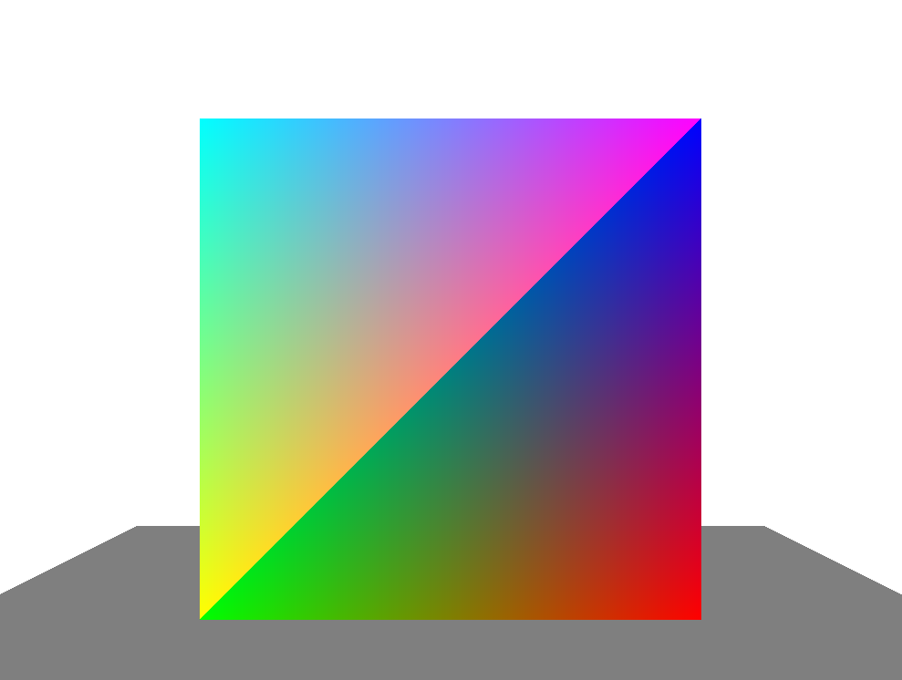
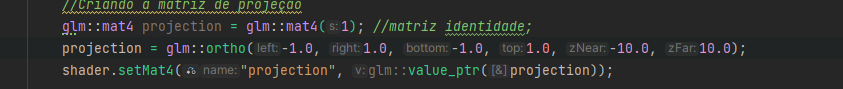

### Tarefas
1 - Crie uma cena com um "chão" (plano) e um cubo 3D (sugestão: pinte cada face do cubo com uma cor diferente)

2 - Adicionar na cena uma projeção paralela ortográfica com os limites em x, y, e z variando de -10 a 10.
