### Tarefas
1 - Gerar 4 mapas "vizinhos" (4 imagens) - parâmetro bounds

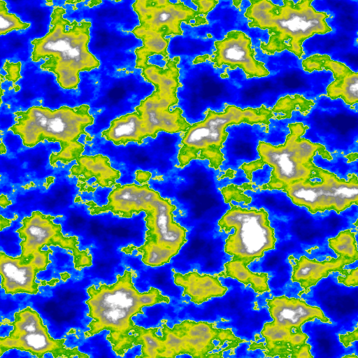
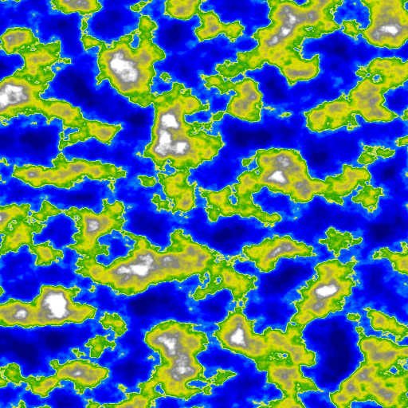
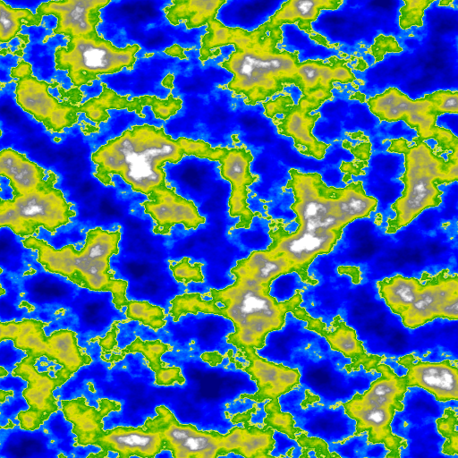
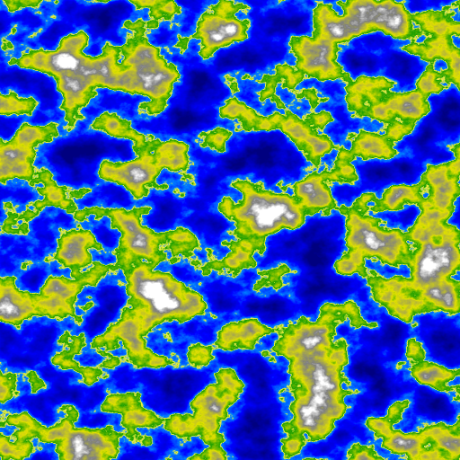

 

Código

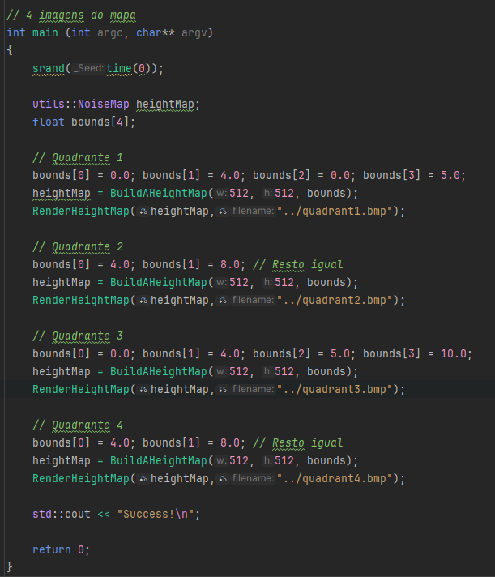
 
2 - Explorar nros diferentes de oitavas, frequencia e persistência (8 imagens)
 
 

Imagem 1: Oitavas = 1, Frequência = 1.0, Persistência = 0.5

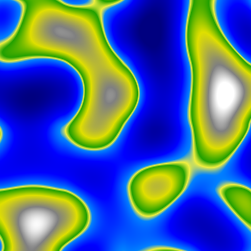
 

Imagem 2: Oitavas = 2, Frequência = 2.0, Persistência = 0.4

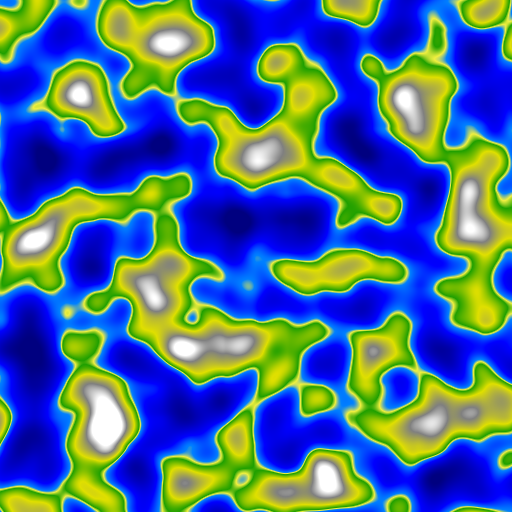
 

Imagem 3: Oitavas = 3, Frequência = 3.0, Persistência = 0.3

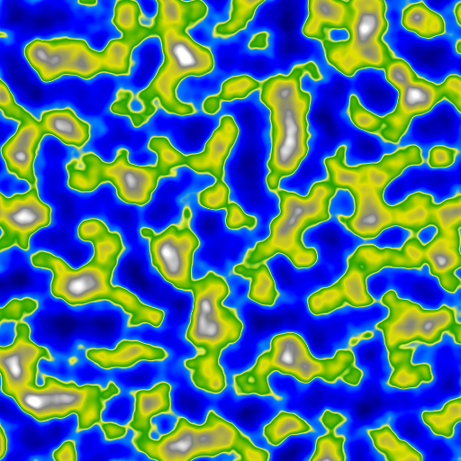
 

Imagem 4: Oitavas = 4, Frequência = 4.0, Persistência = 0.2

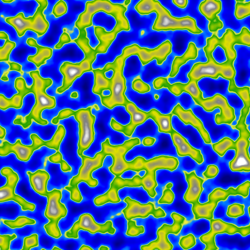
 

Imagem 5: Oitavas = 5, Frequência = 1.0, Persistência = 0.1

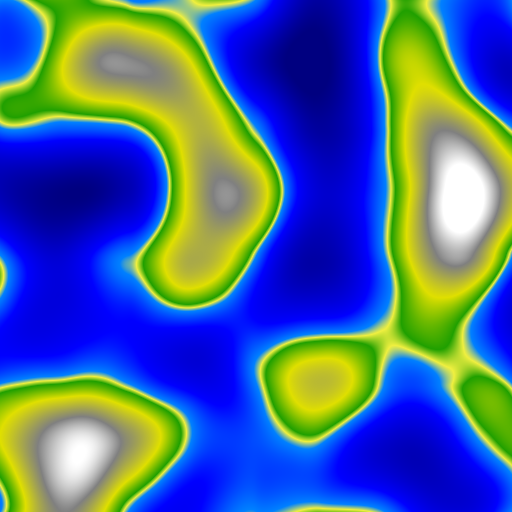
 

Imagem 6: Oitavas = 6, Frequência = 2.0, Persistência = 0.6

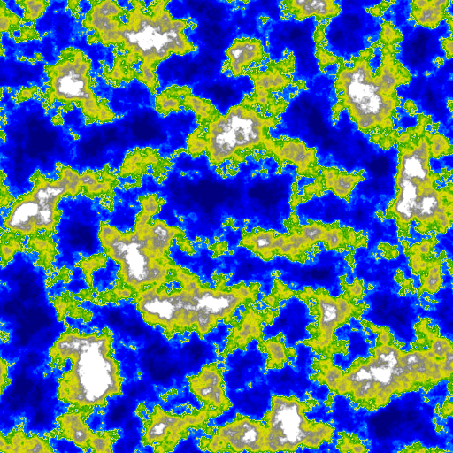
 

Imagem 7: Oitavas = 7, Frequência = 3.0, Persistência = 0.7

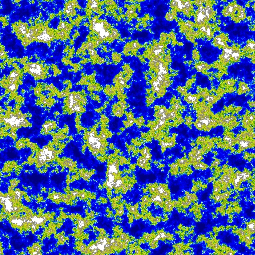
 

Imagem 8: Oitavas = 8, Frequência = 4.0, Persistência = 0.8

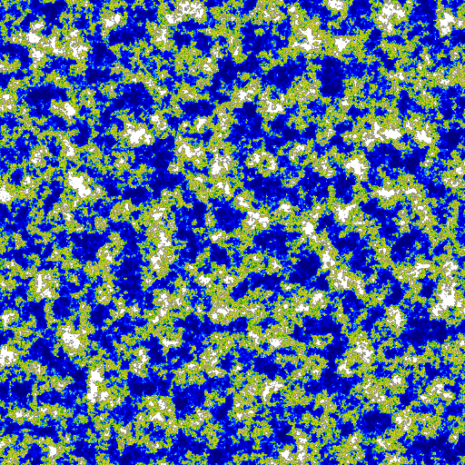
 

3 - Criar pelo menos 2 diferentes mapeamentos de biomas (Gradientes) (2 imagens)

Floresta

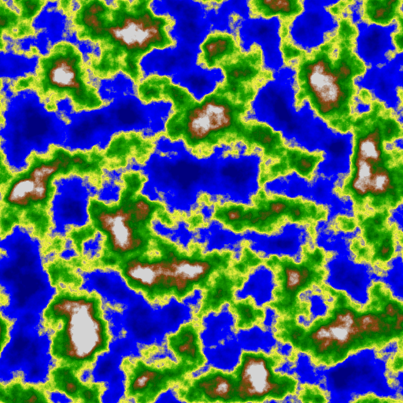

Deserto

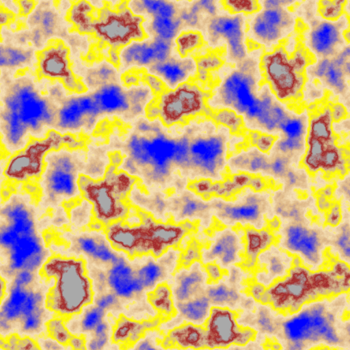
 
Código

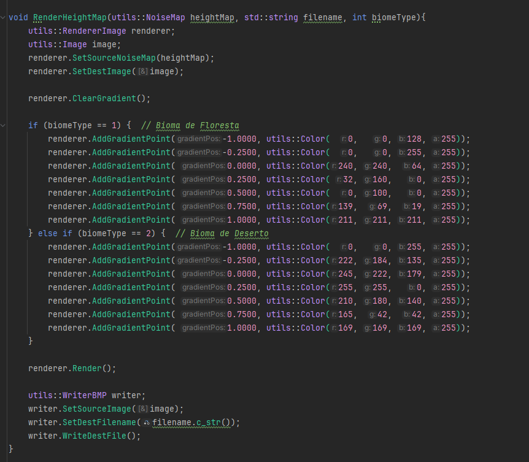
